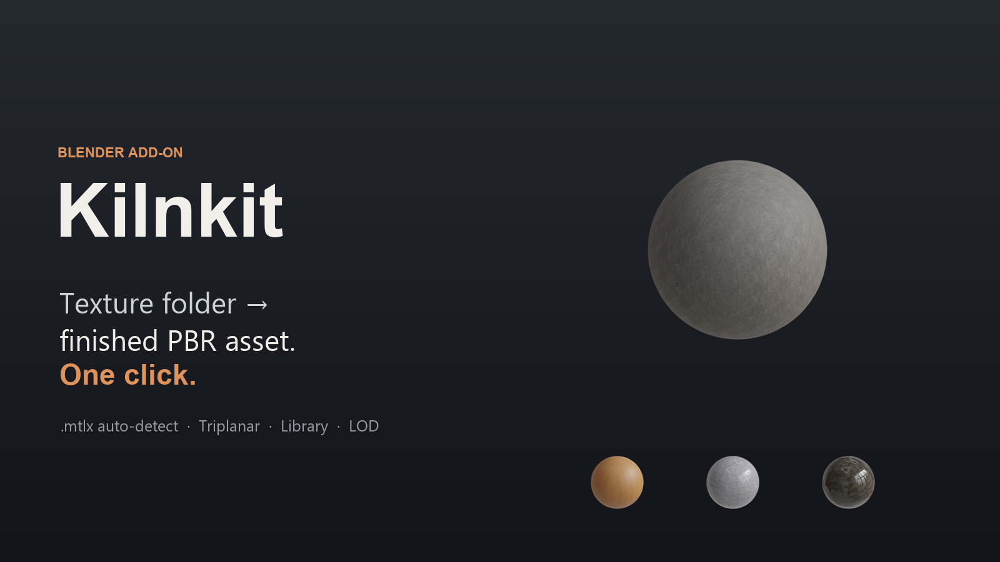
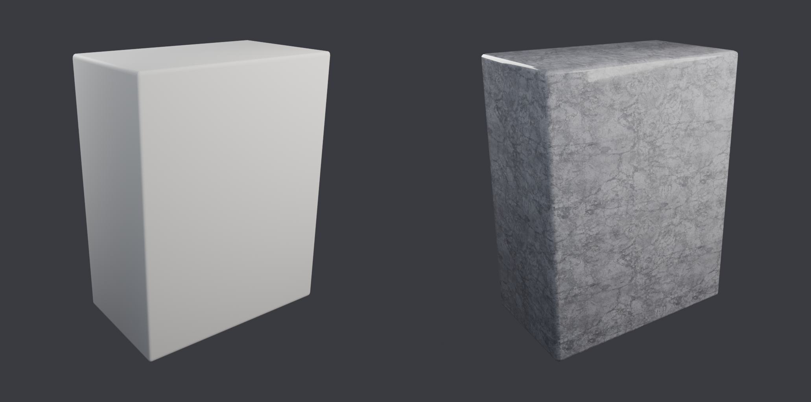
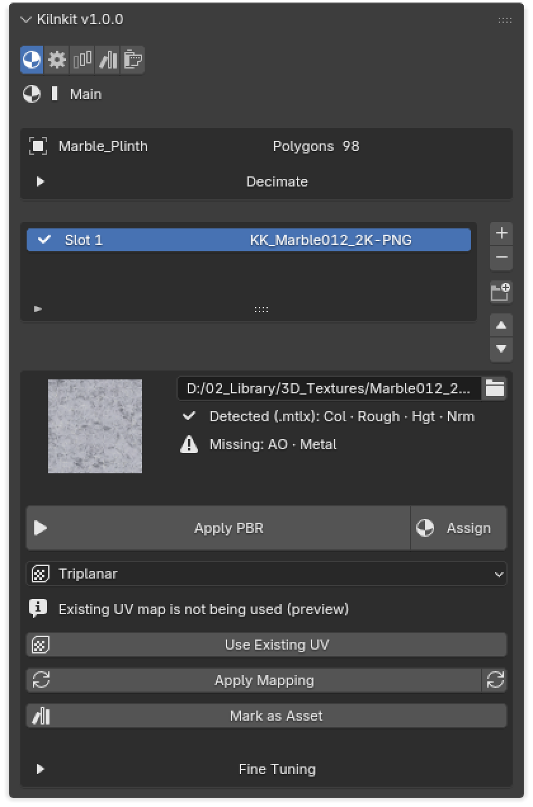
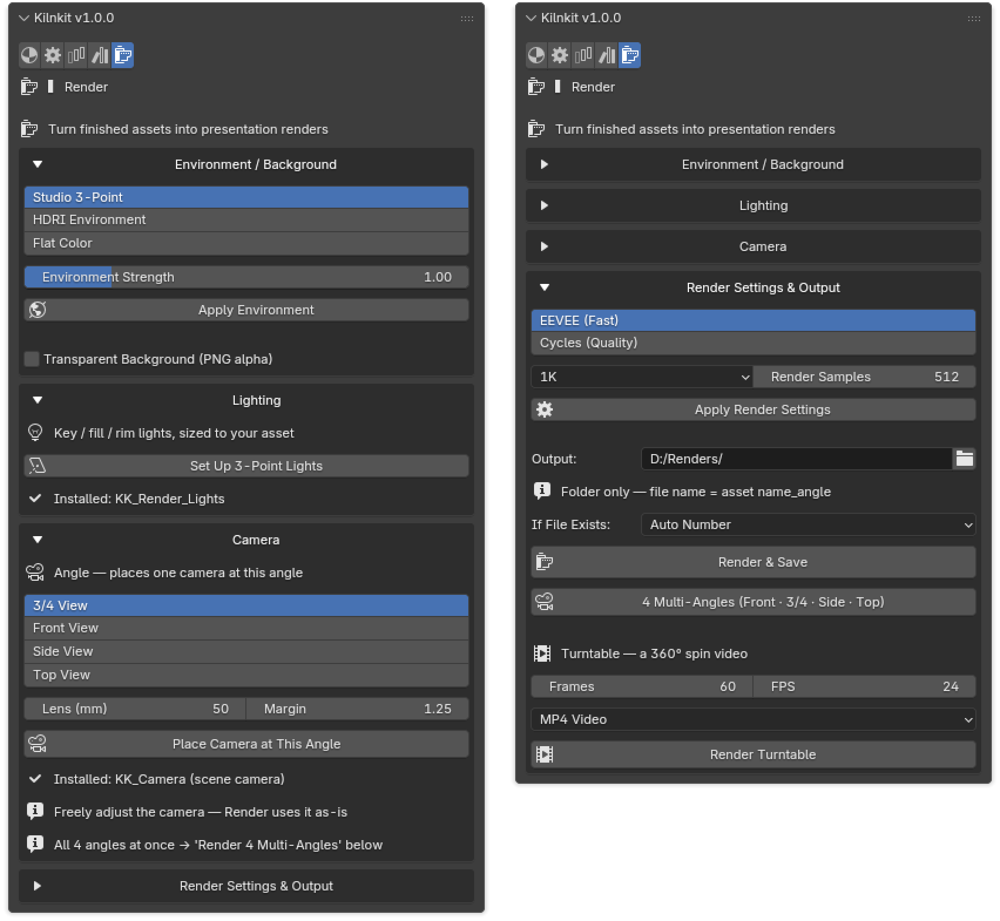
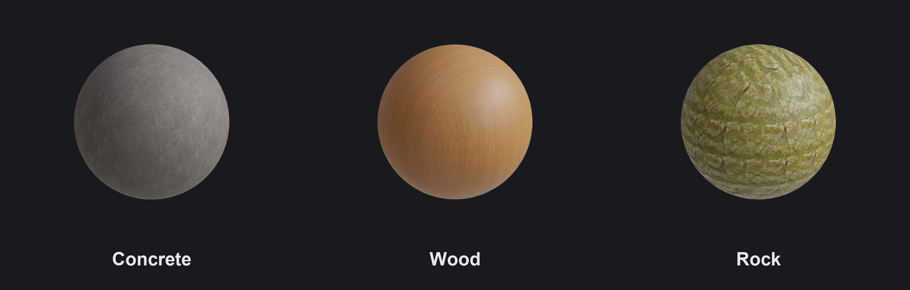
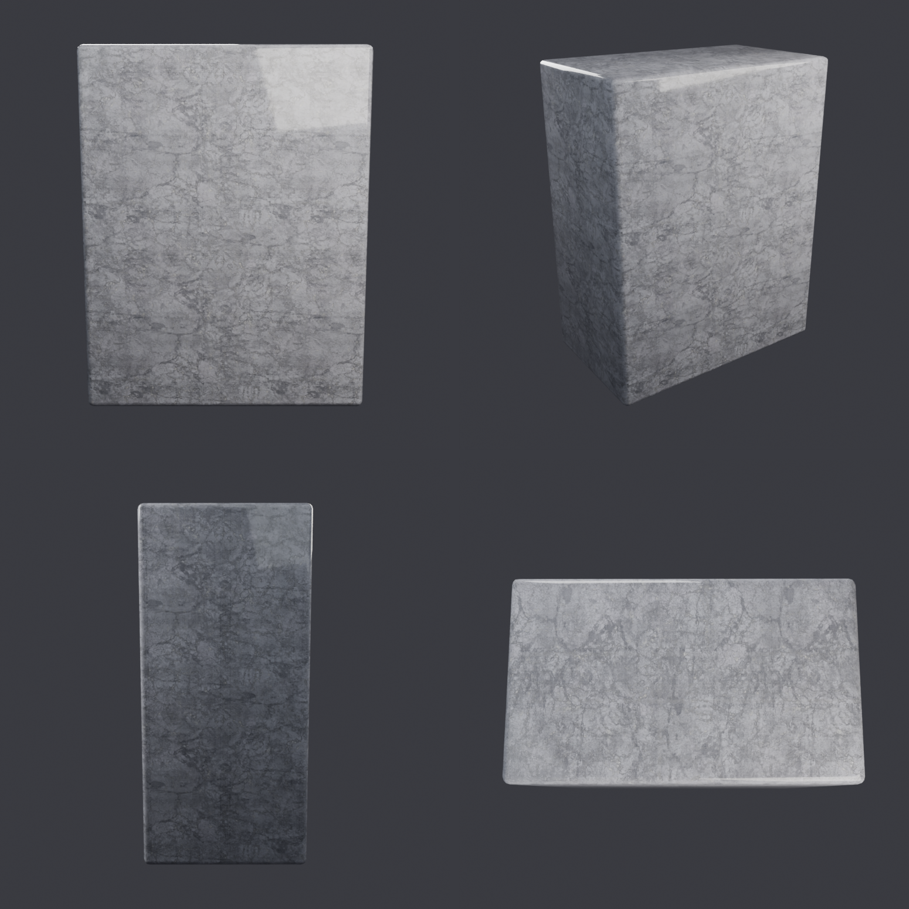

# Kilnkit

> Turn a folder of textures into a render-ready, finished asset — in one click.

**Kilnkit** is a Blender add-on that automates the tedious *finishing* steps of the
PBR material workflow for an existing mesh and a folder of texture maps. Select your
mesh, point a slot at a texture folder, press one button, and get a
fully wired Principled BSDF material — scale applied, textures mapped, nodes connected,
named, and ready for your asset library.

It is built around one idea: **you create, Kilnkit handles the chores.** Scaling,
unwrapping, node wiring, naming, LODs, and library export are repetitive work — so the
add-on does them for you, with **zero external dependencies** in the core.

## Features

- **Finishing guide** — a five-step journey strip above every tab (material → UV → naming
  → shot → output), judged from the scene's *real* state, with an outcome preview (final
  name, resolution, save location), a receipt when done, and a one-click "next step" that
  lands on the right controls.
- **One-click PBR** — scale → texture mapping → node graph, wired to Principled BSDF.
  The default is a seam-free triplanar **preview** that works on any shape without touching
  your UVs.
- **Texture detection** — resolves supported PBR texture-file references from a MaterialX
  (`.mtlx`) sidecar, with filename detection as a fallback. This does not recreate an
  arbitrary MaterialX shader graph. Presets and custom suffixes are available in
  **Settings → Texture Filename Rules**. Uses Python's built-in XML, with no extra packages.
- **Finish UV, when you need it** — triplanar is a preview: it creates no UV map, so the
  panel says so and offers one click to either **use the mesh's existing UV map** or
  **create one**. Baking, texture painting and engine export all need real UVs.
- **6 UV mapping modes** — Triplanar (preview default, seam-free box projection), Keep
  Existing UV, Object, Cube, Smart UV, and SLIM (auto-seam minimum-stretch unwrap).
- **Live sliders** — texture scale (X/Y/Z), AO, normal, and height update the material in
  real time; optional two-way sync with the node graph.
- **Asset-library workflow** — build materials straight from folders without a mesh,
  register them as assets, and export one packed `.blend` per material to your asset library.
- **Multi-asset cleanup** — merge duplicate materials (by texture set), generate
  non-destructive LODs (`_LOD0..n`), and apply unified naming so objects, meshes, and
  materials share one family name — or game-engine type prefixes (`SM_` / `M_`), or your own.
- **Batch mode** — apply to many selected objects at once, or import a parent folder and
  get one slot per sub-folder on the active mesh. Folder imports and library builds run
  in steps; applying to selected objects runs synchronously and can pause the UI.
- **Render output automation** — set up a studio or HDRI environment (with transparent
  background), three-point lighting, and an auto-framed camera, then render multi-angle
  stills and a 360° turntable video — all from one **Render** tab, so you can present a
  finished asset without leaving Blender. Ratio resolution presets (1:1 / 16:9 / 9:16 /
  4:5) write straight into Blender's native output, an **isolate** toggle keeps other
  meshes out of the shot, and a camera view you refine is **saved per asset** and restored
  in one click when you come back.

## Requirements

- **Blender 4.5 LTS** or newer — verified through **5.2 LTS**.

## Installation

1. Download the release `.zip` for your edition; leave it zipped.
2. In Blender 4.5 or 5.2: **Edit → Preferences → Add-ons**, open the top-right
   drop-down menu, choose **Install from Disk…**, and select the ZIP.
3. Complete installation, then check that **Kilnkit** is enabled in the Add-ons list.

Kilnkit itself needs this installation; no additional Python packages are required.

The panel appears in the **3D Viewport sidebar** (press **N**) under the **Kilnkit** tab.

> **Language:** the interface is in **English** by default. Korean is also included — switch
> via **Edit → Preferences → Interface → Translation → Language → 한국어**.

## Quick start

1. In **Object Mode**, select the mesh you want to finish, then open **N → Kilnkit**
   in the 3D Viewport. Bring your own mesh and texture maps.
2. On **Main**, click **Start by Picking a Texture Folder** and choose the folder
   containing one texture set. This creates a slot and applies PBR automatically.
   For an existing slot, set its folder and press **Apply PBR**.
3. Check the slot's **Detected** / **Missing** channels and view the result in Blender's
   **Material Preview** shading. Adjust texture scale, AO, normal, and height as needed.
4. The default **Triplanar** mapping is a preview using object coordinates; it creates
   no UV map. For a mesh with suitable UVs, choose **Keep Existing UV** and press
   **Use Existing UV**. Otherwise use **Create UV Map** when offered, or select an
   unwrap method and apply it. Creating UVs can replace the current UV map.
5. Check the result after changing mapping. Switching to UVs does not bake the triplanar
   appearance or guarantee the same look in an engine; baking/export needs a separate
   workflow suited to the destination.

For multiple materials, add a slot per texture folder and assign each to faces. The
**Batch** tab processes selected meshes; importing subfolders adds slots to the active
mesh rather than creating new mesh objects. **Library** can build materials without a mesh.

### Texture filenames and MaterialX

Open **Settings → Texture Filename Rules**. **Auto Detect** uses filename keywords;
choose a preset for a known naming scheme or **Custom** to edit Base Color, Normal,
Roughness, Height, AO, and Metallic suffixes. The custom fields are ignored in Auto Detect.
For example, Custom defaults recognize `wood_c.png`, `wood_n.png`, and `wood_r.png`.
Keep one texture set per folder and check the detected channels before applying.

A resolvable `.mtlx` sidecar takes precedence over filename presets. Kilnkit follows
supported surface/displacement connections to image files and supplements missing
channels with filename keywords. If no usable sidecar mapping is found, it uses the
selected filename rule. Mix/multiply nodes are followed to a texture input; their math,
layering, procedural effects, and full shader appearance are not reproduced. Check
normal-map orientation and the resulting material visually.

### Free and Full

**Free** includes the material/UV workflow, filename rules, batch tools, asset-library
export, and individual render automation including multi-angle stills and turntables.
**Full** adds the **Publish** tab with a render queue and contact sheets.
See [the edition comparison](https://kilnkit.com/#editions).

## Screenshots

**One click: texture folder → finished, wired material**

**The main panel — slots, detected channels, and live sliders**

**Render tab — environment, camera, and output automation**

**One material set, many looks — same pipeline, any folder**

**Multi-angle stills, generated automatically**

## Development

Kilnkit is designed, built and maintained by one person — a Blender user who kept
meeting the same finishing chores in his own scenes, and finally built the tool for them.

Parts of the code were written with the help of AI coding assistants.
The design decisions, the testing and the release are the author's, and the author is
responsible for the result. Commits made with AI assistance carry an `Assisted-by:`
trailer.

## Support

- **Bugs and feature requests** — <https://github.com/kilnkit/kilnkit/issues>
- **Email** — kilnkithq@gmail.com
- **Website** — <https://kilnkit.com>

## License

Kilnkit is free software, licensed under the **GNU General Public License v3.0 or later**
(GPLv3+). See [LICENSE](LICENSE) for the full text.

Copyright (C) 2026 Deokho Kim
